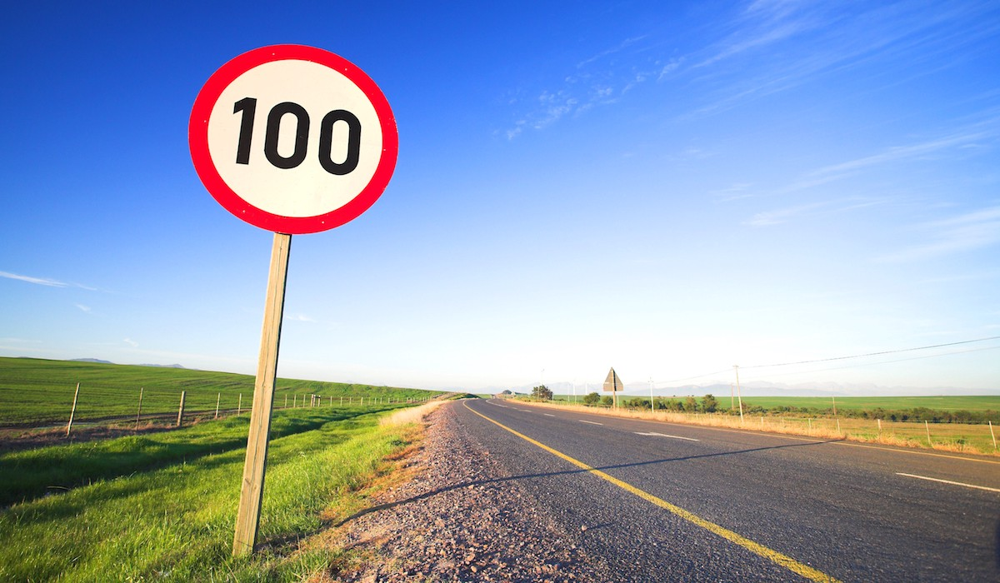
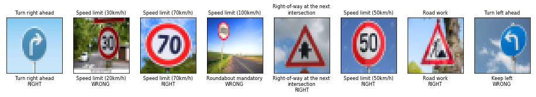
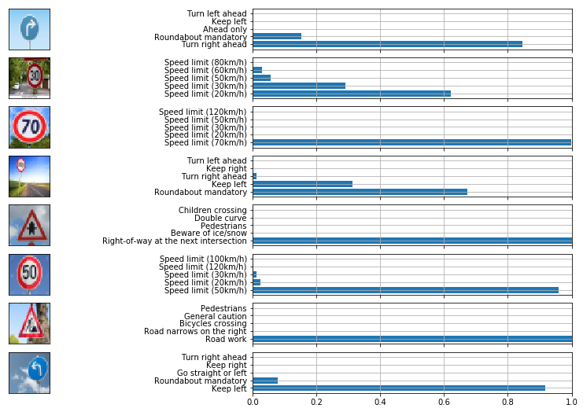

# **Traffic Sign Recognition** 

## Writeup

**Build a Traffic Sign Recognition Project**

The goals / steps of this project are the following:
* Load the data set (see below for links to the project data set)
* Explore, summarize and visualize the data set
* Design, train and test a model architecture
* Use the model to make predictions on new images
* Analyze the softmax probabilities of the new images
* Summarize the results with a written report


[//]: # (Image References)

[image1]: ./examples/visualization.jpg "Visualization"
[image2]: ./examples/grayscale.jpg "Grayscaling"
[image3]: ./examples/random_noise.jpg "Random Noise"
[image4]: ./examples/placeholder.png "Traffic Sign 1"
[image5]: ./examples/placeholder.png "Traffic Sign 2"
[image6]: ./examples/placeholder.png "Traffic Sign 3"
[image7]: ./examples/placeholder.png "Traffic Sign 4"
[image8]: ./examples/placeholder.png "Traffic Sign 5"

## Rubric Points
### Here I will consider the [rubric points](https://review.udacity.com/#!/rubrics/481/view) individually and describe how I addressed each point in my implementation.  

---
### Writeup / README

#### 1. Provide a Writeup / README that includes all the rubric points and how you addressed each one. You can submit your writeup as markdown or pdf. You can use this template as a guide for writing the report. The submission includes the project code.

You're reading it! and here is a link to my [project code](https://github.com/nagyben/CarND-Traffic-Sign-Classifier-Project/blob/master/Traffic_Sign_Classifier.ipynb)

### Data Set Summary & Exploration

#### 1. Provide a basic summary of the data set. In the code, the analysis should be done using python, numpy and/or pandas methods rather than hardcoding results manually.

I used the pandas library to calculate summary statistics of the traffic
signs data set:

* The size of training set is **34799**
* The size of the validation set is **4410**
* The size of test set is **12630**
* The shape of a traffic sign image is **32 x 32 pixels**
* The number of unique classes/labels in the data set is **43**

#### 2. Include an exploratory visualization of the dataset.

Here is an exploratory visualization of the data set.


We can see that the training data is not evenly distributed over the sign classes. Certain signs are over-represented where the network will likely perform well on, whereas other signs are under-represented which the network will likely perform poorly on.

It would be wise to augment the training set with additional training examples.

### Design and Test a Model Architecture

#### 1. Describe how you preprocessed the image data. What techniques were chosen and why did you choose these techniques? Consider including images showing the output of each preprocessing technique. Pre-processing refers to techniques such as converting to grayscale, normalization, etc. (OPTIONAL: As described in the "Stand Out Suggestions" part of the rubric, if you generated additional data for training, describe why you decided to generate additional data, how you generated the data, and provide example images of the additional data. Then describe the characteristics of the augmented training set like number of images in the set, number of images for each class, etc.)

I decided **not** to convert the images to grayscale, because color information is extremely important when it comes to traffic sign recognition, especially the red and blue channels.

I experimented with normalization and it turns out that my network was able to train much better on non-normalized images. Weirdly, this goes against the conventional logic that input data should be normalized.

I decided to generate additional data because the sign classes were not equally represented in the training set, which would lead to poor performance.

To add more data to the the data set, I created some functions to randomly apply various transformations:
- Translation
- Shear
- Rotation
- Brightness/contrast adjustment

An example of this generation is shown below:


The top-left image is the original. All the other images are the original with a random composition of the aforementioned transformations applied.

After running the data augmentation, I get the following distribution of training images:


#### 2. Describe what your final model architecture looks like including model type, layers, layer sizes, connectivity, etc.) Consider including a diagram and/or table describing the final model.

My final model is heavily based on LeNet and consists of the following layers:

| Layer         		|     Description	        					| 
|:---------------------:|:---------------------------------------------:| 
| Input         		| 32x32x3 RGB image   							| 
| Convolution 5x5     	| 1x1 stride, valid padding, outputs 28x28x6 	|
| RELU					|												|
| Max pooling	      	| 2x2 stride, valid padding, outputs 14x14x6 	|
| Convolution 5x5	    | 1x1 stride, valid padding, outputs 10x10x16   |
| RELU	            	|           									|
| Max pooling			| 2x2 stride, valid padding, outputs 5x5x16		|
| Convolution 1x1		| 1x1 stride, valid padding, outputs 5x5x64		|
| RELU					|												|
| Fully connected       | outputs 1600x1                                |
| Dropout               |                                               |
| Fully connected       | outputs 120x1                                 |
| RELU                  |                                               |
| Fully connected       | outputs 84x1                                  |
| RELU                  |                                               |
| Fully connected       | outputs 43x1                                  |
 

There were many iterations of the model, this final one was achieved largely through trial-and-error of modifying the following characteristics:
- Number of layers
- Convolution kernel size
- Padding type of each layer (valid padding seems to give higher validation set accuracy. No idea why)
- 


#### 3. Describe how you trained your model. The discussion can include the type of optimizer, the batch size, number of epochs and any hyperparameters such as learning rate.

To train the model, I used an Adam optimizer to minimize the cross entropy. I used a variable learning rate which I set to decrease over the number of epochs.

The number of epochs was **40**. This was chosen based on how quickly my model trains. I also used dropout, which meant I needed more epochs to achieve a good result with regularization.

A batch size of **128** seemed to be ideal for this problem. I experimented with smaller and bigger batch sizes, batch sizes larger than 256 seemed to reduce the performance of the training.

There were many iterations of the hyperparameters and there does seem to be a coupling between them as well. The approach of trial-and-error does not seem efficient; however I am not aware of a better methodology for optimizing hyperparameters. Of course, one could use standard optimization techniques to find the best hyperparameters, but those techniques hyperparameters to define which would also need to be optimized, and so on and so forth.

#### 4. Describe the approach taken for finding a solution and getting the validation set accuracy to be at least 0.93. Include in the discussion the results on the training, validation and test sets and where in the code these were calculated. Your approach may have been an iterative process, in which case, outline the steps you took to get to the final solution and why you chose those steps. Perhaps your solution involved an already well known implementation or architecture. In this case, discuss why you think the architecture is suitable for the current problem.

The output of the final training run is shown below


```
Training...
   Epoch   Train   Valid  learn rate
       1   0.344   0.498    0.001000
       2   0.514   0.673    0.001000
       3   0.629   0.776    0.001000
       4   0.692   0.844    0.001000
       5   0.725   0.838    0.001000
       6   0.765   0.877    0.001000
       7   0.780   0.882    0.001000
       8   0.804   0.887    0.001000
       9   0.809   0.888    0.001000
      10   0.840   0.899    0.001000
      11   0.849   0.906    0.001000
      12   0.860   0.910    0.001000
      13   0.860   0.905    0.001000
      14   0.883   0.920    0.001000
      15   0.880   0.899    0.001000
      16   0.880   0.923    0.001000
      17   0.906   0.935    0.000500
      18   0.914   0.934    0.000500
      19   0.905   0.932    0.000500
      20   0.919   0.935    0.000500
      21   0.921   0.932    0.000500
      22   0.927   0.936    0.000500
      23   0.925   0.937    0.000500
      24   0.929   0.939    0.000500
      25   0.931   0.936    0.000500
      26   0.935   0.937    0.000500
      27   0.938   0.936    0.000500
      28   0.932   0.940    0.000500
      29   0.938   0.937    0.000500
      30   0.943   0.939    0.000500
      31   0.942   0.942    0.000500
      32   0.941   0.937    0.000500
      33   0.942   0.935    0.000500
      34   0.954   0.942    0.000100
      35   0.956   0.943    0.000100
      36   0.956   0.945    0.000100
      37   0.956   0.940    0.000100
      38   0.957   0.942    0.000100
      39   0.956   0.940    0.000100
      40   0.958   0.943    0.000100
```

My final model results were:
* training set accuracy of **95.8%**
* validation set accuracy of **94.3%** 
* test set accuracy of **92.2%**


The first architecture I tried was the original LeNet with RGB input instead of grayscale without any augmentation. The performance of this network on the validation set was very low, at about 70%.

After this, I experimented with the number of layers, the layer types, the hyperparameters without augmentation and the performance did not change.

It was only after augmentation of the data that my network was achieving 90%+ on the validation set. This was single most effective change which I made to my code to improve the performance of the network. 

Finally, dropout helped to regularize the network to achieve the final few percentage points of performance on the validation set to achieve a passing grade on this assignment.

The parameters which I fine-tuned at the end were the batch size and the learning rate. I implemented a variable learning rate because the network increases performance quickly for the first 10 epochs and then slows down in improvement considerably, but still continues increasing slowly over the following 30 epochs. With a variable learning rate, I was able to reduce the step size at the higher epochs to reduce instability.
 

### Test a Model on New Images

#### 1. Choose five German traffic signs found on the web and provide them in the report. For each image, discuss what quality or qualities might be difficult to classify.

Here are some German traffic signs that I found on the web:


This one should be easy to classify - the sign takes up the majority of the image and is clear

---


This one will be difficult to classify because the sign is only about half of the image and there are trees, roads and a car in the background. It also has a watermark at the bottom.

---


This one should be easy because the sign is the majority of the image, however the watermark might cause some problems

---


Tough to say - the sign is the majority of the image but there is a tree behind it and the leaves cast shadows onto the sign itself

---


Should be easy - plain image of a sign with no background shapes

---


Hard to say - clear image but there are clouds behind the sign

---


Should be easy - though the contrast with the leaves and sky might make it difficult

---


This one should be impossible - the sign makes up about 10% of the picture.

All of these images were quite big and so needed to be resized to 32x32. The ground truth labels are given above the image:


#### 2. Discuss the model's predictions on these new traffic signs and compare the results to predicting on the test set. At a minimum, discuss what the predictions were, the accuracy on these new predictions, and compare the accuracy to the accuracy on the test set (OPTIONAL: Discuss the results in more detail as described in the "Stand Out Suggestions" part of the rubric).

The model predictions are shown below:



Accuracy: **62.5%**

The model was able to correctly guess 5 out of 8 images which I selected from the web.

To the model's credit, I picked some quite difficult images to classify, given that most of them were not taking up the full extent of the image and most also had a lot going on in the background.

Discussing the images from left to right:

| Truth | Prediction | Discussion |
| --- | --- | --- |
| Turn right ahead | Turn right ahead | As expected, the sign against the clear sky with no distinct shapes meant that the network correctly identified the sign class |
| 30 kph | 20 kph | The network was almost correct, it had the correct type of sign (speed limit) but not the correct number. This could be due to the significantly lower resolution of the number '3' within the 32x32 pixel representation |
| 70 kph | 70 kph | As expected, this was identified correctly, and the contrasting sky/tree in the background was not enough to fool the network |
| 100 kph | Roundabout mandatory | As expected, the network had no idea what this sign was, because when we look at the 32x32 pixel representation, the sign takes up a ~5x5 corner of it with not enough information to have a hope in identifying it correctly |
| Right of way at next intersection | Right of way at next intersection | As expected, a clear large sign was correctly identified |
| 50 kph | 50 kph | A clear sign against a blue sky. The downsampling to 32x32 also got rid of the watermark which I was afraid might have caused issues |
| Road work | Road work | A correct identification despite having contrasting shapes in the background and shadows on the sign itself |
| Turn left ahead | Keep left | While the sign is clear in the image, the white clouds behind are enough to cause an incorrect detection |

#### 3. Describe how certain the model is when predicting on each of the five new images by looking at the softmax probabilities for each prediction. Provide the top 5 softmax probabilities for each image along with the sign type of each probability. (OPTIONAL: as described in the "Stand Out Suggestions" part of the rubric, visualizations can also be provided such as bar charts)

The top 5 predictions are shown below:


In most cases, the network is quite confident in itself.

Some interesting observations:
- The 30kph sign was 60% sure it was a 20kph sign and 30% sure it was a 30kph sign - so the second guess was correct.
- For all speed limit signs, the top 5 predictions are all speed limits - the difficulty is what the number is
- In fact, for all of the signs, the top 5 predictions are all signs of the same shape (i.e. circle for speed limits / triangle for road works) - even the 100kph one which can barely be made out
